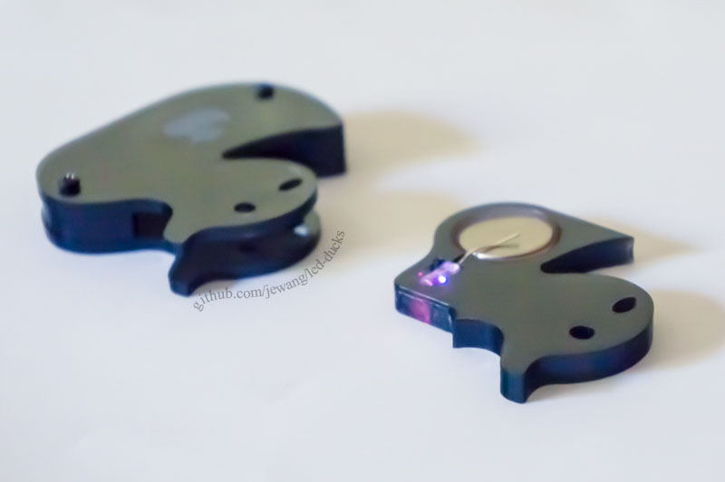

led-ducks: Baby Duck LED Pendants
=========

These baby duck LED pendants are a little art project that I did with [David Kaufman](https://github.com/dakaufma) with help from [Alex Willisson](https://github.com/AlexWillisson). It is inspired by and heavily adapted from [Winnie Tong](http://happynerdcore.com)'s chibi skull LED pendant design. The duck image comes from [VectorInk](http://vectorink.com/toy/rubber-duck-0078/).

In the below image, the left duck is the finished product. The right duck was our initial prototype.

# How it works

Four pieces of acrylic come together to make this duck. The idea is to sandwich three pieces of acrylic to form a slot that a fourth piece of acrylic can slide into and out of. The fourth piece holds the LED and battery so that wearers can manually turn on and off the led. You can see this sandwich design in the below two pictures.

# How to make your own

## Tools Needed:

- Philips screwdriver
- Laser cutter
- Wire cutters (optional)

## Materials for 1 duck (with suggested links)

- 1/8" (3mm) acrylic* - at least 5.5" x 2.5" (this forms the outer two layers of the duck)
- 1/4" (6mm) acrylic* - at least 2.75" x 2.5" (this forms the inner layer of the duck)
- 2 #2-56 7/16" Length, Fully Threaded, Black Oxide, Pan Head Screws ([Amazon Supply](http://www.amazon.com/Stainless-Machine-Phillips-B18-6-3-Threads/dp/B00DD45YLA))
- 1 CR2032 battery ([Ebay](http://www.ebay.com/sch/i.html?_from=R40&_trksid=p2050601.m570.l1313.TR11.TRC1.A0.H0.Xcr2032&_nkw=cr2032&_sacat=0))
- 1 5mm Cycling RGB (slow) ([Sparkfun](https://www.sparkfun.com/products/11450))
- 18-20 in S'getti Cord ([Amazon](http://www.amazon.com/Pepperell-Sgetti-Strings-Jewelry-Project/dp/B003M44CH8/ref=sr_1_1?s=arts-crafts&ie=UTF8&qid=1408584055&sr=1-1&keywords=S%27getti)) 

\* Feel free to choose whatever colors you prefer. We used black-orange-black for our prototype and black-black-black for our final ducks. We went to our local plastics store to buy acrylic.

## Steps

1. Cut [cad/outside-duck-1-8.ai](cad/outside-duck-1-8.ai) out of the 1/8" acrylic. The red lines denote vector paths to cut along. The blue represents a rastered image to engrave. You should have two duck pieces. 
1. Cut [cad/inside-duck-1-4.ai](cad/inside-duck-1-4.ai) out of the 1/4" acrylic. The red lines denote vector paths to cut along. You should end up with two more duck pieces.
1. Sandwich the 6mm duck bottom between the two 1/8" duck pieces to form a slot. Screw these pieces together using the two screw holds on either side of the duck. Please note that the head of the screw should be on the side where the duck is facing to the right. This is important the screw holes on the first two layers are through-hole layers. The screw only screws into the back layer.
1. Put the battery and LED into the remaining 1/4" duck piece so that the LED legs are on either side of the battery. If the LED does not light up, flip the sides that the legs touch. You might need to snip off the ends of legs if they are too long.
1. Slide this remaining duck piece into the sandwiched duck slot. If the LED does not stay on, you might need to bend the LED legs so that it has "knees" that squeeze toward the battery (kind of like [this](http://www.visualphotos.com/image/1x4182013/back_view_of_womans_legs_with_knees_together)).
1. Secure the construction by threading the S'getti cord through the oval using a [Girth Hitch](http://www.netknots.com/rope_knots/girth-hitch/).
1. To turn off the LED, undo the knot and move the LED legs so that they are both on the same side of the battery. You could also just take the battery out.

Below is an example of how to tile the CAD drawings if you're interested in making a lot of ducks.

# More Pictures

